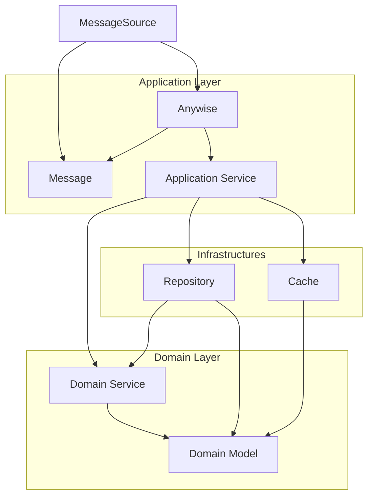

# Domain Driven Design

In this chapter we will talk about how to use anywise in a codebase that follows domain driven design, or a DDD-oriented microservice.

## Architecture

```mermaid
graph TD
    MS[MessageSource]

    subgraph Application Layer
    M[Message]
    A[Anywise]
    AS[Application Service]
    end

    subgraph Domain Layer
    DS[Domain Service]
    DM[Domain Model]
    end

    subgraph Infrastructures
    R[Repository]
    C[Cache]
    end
    
    MS --> M
    MS --> A
    A --> AS
    A --> M
    AS --> DS
    DS --> DM

    AS --> R
    R --> DS
    R --> DM

    AS --> C
    C --> DM
```
