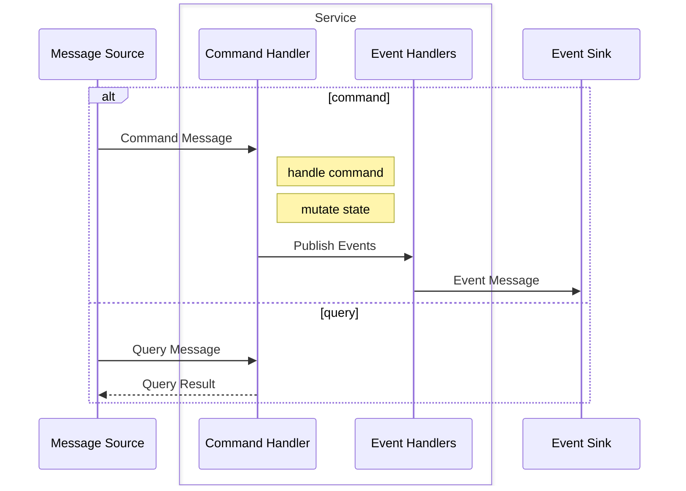

# Source-Service-Sink Architecture

Message Source sends commnad to command handler,
command handler handles the command, mutate state and persist it to database,
then record the side-effect by emitting a event, which will be handled by event handles,
event handles will either handle the event directly, or forward it to other services
the event will eventually be stored in the event sink.

