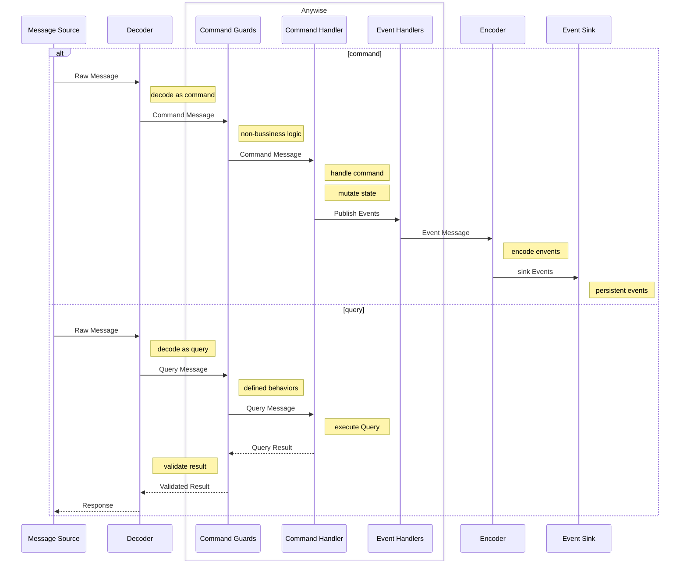
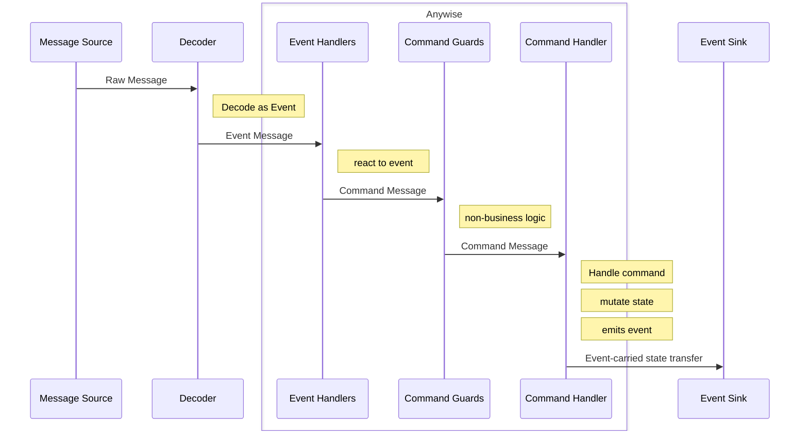

# Microservice

## Introduction

In this chapter, we will talk about how to apply anywise in a microservice architecture
as well as event driven architecture

EDA is a superset of microservices, it focus on the communication between services.

### `Microservices Architecture`

Microservices architecture is a design pattern where a system is broken down into small, independent services that communicate over a network. Each service focuses on a specific business function, is loosely coupled, and is independently deployable.
These services can be developed, deployed, and scaled independently, enabling agility, flexibility, and fault tolerance.

### `Event-Driven Architecture` (EDA)

Event-driven architecture is a design pattern where systems react to events (changes in state or significant occurrences). In EDA, components (or services) produce, listen to, and react to events, typically through event brokers or message queues.
It allows for asynchronous communication between components, enabling highly decoupled and scalable systems. It is widely used in systems where real-time processing or loosely coupled interaction is needed.

### Orchestration

### Choreography

In this case, Message source is often a message queue, e.g. kafka